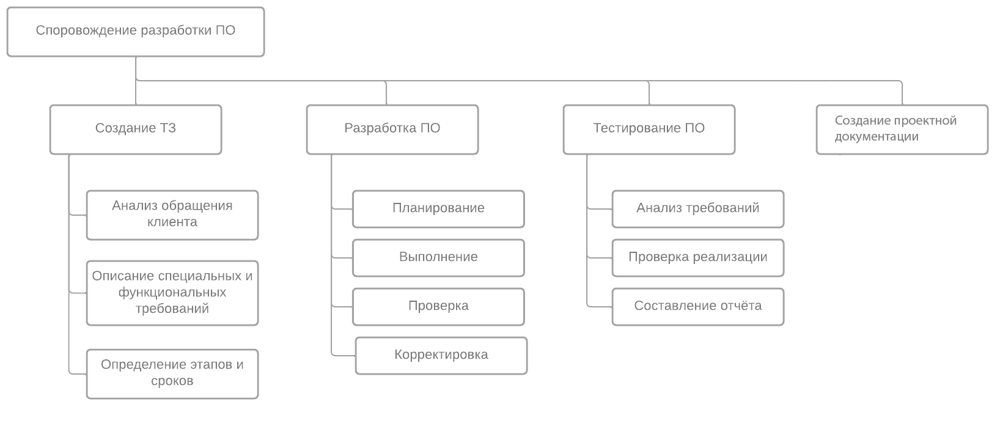
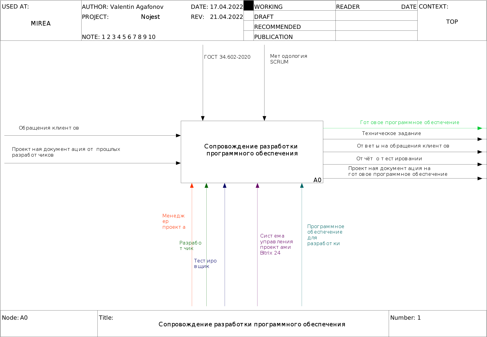

# 1 Исследовательский раздел

## 1.1 Обобщенная характеристика предметной области

## 1.1.1 Характеристика объекта исследования

Объектом исследования настоящей выпускной квалификационной работы является типовая IT-компания. Чтобы получить полное представление о такой организации, далее будут рассмотрены примеры существующих IT-компании, выделены в схожие элементы и, на основании этих совпадающих критериев, сложится общая картина типовой организации.
В целях наиболее адекватного исследования, отвечающего достижению цели работы, ограничимся анализом компаний IT–рынка, действующих на российском рынке. При этом следует понимать, что ввиду особенностей отрасли IT, география деятельности подобных компаний не может быть в целом ограничена лишь указанным государством, и, по большому счету, клиенты и партнеры у организаций сектора – это и другие государства, зарубежные заказчики. К анализу примем небольшие IT–компании, успешно работающие на рынке в течение нескольких лет (крупные компании не будут являться прототипом ввиду сложности их внутренней организационной структуры, внешних связей, объемов реализации услуг и другим параметрам модели организации бизнеса).
Представим для анализа несколько компаний, работающих в IT–секторе на российском рынке: ООО «PP–Коннект» (г. Москва); веб–студия «Мульти Сайт» (Калининградская область); ООО «ВБК» (г. Владивосток).
Компании выбраны, исходя из позиции географического присутствия центрального офиса. Такой «разброс» по городам России поможет представить более полноценное понимание инфраструктуры построения бизнеса в области IT, разграничить возможные различия по регионам РФ и обобщить показатели, т.е. будет способствовать более полноценному представлению о типовой IT–компании.

...

Исходя из проведенного анализа нескольких компаний на рынке IT, можно утверждать, что общими для любой компании отрасли является линейность структуры с элементами функциональности. Для небольших предприятий целесообразно выбирать линейную структуру, отличающуюся простотой и понятностью, легкостью принятия управленческих бизнес–решений. 
Кроме того, характерным признаком, обобщающим все небольшие IT–компании, вне зависимости от их расположения, – это и весьма небольшая доля занимаемого ими рынка (не более 2–3%, в лучшем случае – до 5%, если речь о небольшом населенным пункте). Для современных небольших IT–компаний принципиально важным является развитие сразу нескольких направлений для развития: компания должна предоставлять желательно целый спектр IT–решений, а не какую–то одну услугу. 
Именно системность и диверсификация производства позволяет современной IT–компании удержаться на рынке, а если речь о новой компании – то это шанс для занятия определенной доли рынка. Отличия же, в основном, сводятся к производственным возможностям, зависящим от финансирования и его возможностей. Таким образом, очевидно, что типовая IT–компания – это открытая система с линейной или функциональной структурой, способная проводить анализ внешней среды (на основе постоянного мониторинга конкурентов и их услуг), стремящаяся к постоянному совершенствованию и расширению набора услуг для потребителей (заказчиков и партнеров).
В организационной структуре типовой IT-компании можно выделить подразделения, которые в будущем будут использовать новую информационную систему для сопровождения разработки программного обеспечения. Для этой цели организационные структуры описанных выше компаний были обобщены и показаны на рисунке 1.6

Рисунок 1.6. Организационная структура типовой IT-компании

Генеральный директор в небольших компаниях, как правило, помимо основных обязанностей сам занимается стратегическим планированием, управлением затратами, расчётом возврата инвестиций. Решение о целесообразности разработки нового программного обеспечения принимает именно он. В более крупных организациях лидер делегирует стратегическое планирование финансовому отделу. Очевидно, что и генеральному директору, финансовому отделу будет полезно иметь инструмент для анализа рентабельности выполненных проектов и прогноза будущих.
Функции бухгалтерии и отдела кадров зачастую делегируются сторонним подрядчикам. Эти отделы не связаны напрямую с процессом сопровождения разработки, поэтому исключим их из рассмотрения.
Аналитический отдел призван заниматься тактическим планированием по текущим проектам компании. В зависимости от размера компании это может быть как один менеджер проекта, так и команда менеджеров с руководителем отдела во главе. Менеджер проекта общается с заказчиком, пишет техническое задание для разработчиков и документацию по проекту.
Отдел разработки подчиняется аналитическому отделу и состоит из одной или нескольких команд разработчиков. Чем больше команд есть в этом отделе, тем больше проектов компания может выполнять параллельно. Каждый разработчик в команде может иметь свою специализацию и свой уровень компетенции меняющиеся со временем. Обычно эти ячейки коллектива складываются исторически, а не назначаются руководством. Как видно из названия, отдел разработки занимается созданием и доработками программ, исправлением ошибок.
Отдел тестирования тоже подчиняется аналитическому. Главная функция отдела – это выявление ошибок в проектах, которые разрабатывает организация. Помимо этого, тестировщики делают анализ изменений в проектах, пишут отчеты по ошибкам, автоматизируют регрессионное тестирование.
Менеджерам, разработчикам и тестировщикам для продуктивной работы необходима система сопровождения проектов, которая позволит участникам взаимодействовать через создание задач и изменение их статусов. Каждое изменение статуса в такой системе символизирует переход ответственности по задаче от одного сотрудника к другому. Таким образом организационная структура типовой IT-компании предполагает следующие роли пользователей в системе сопровождения проектов: менеджер проекта, разработчик, тестировщик.

## 1.1.2 Описание внешней среды функционирования объекта исследования

В ходе анализа работы компаний данной отрасли важным является оценка внешней среды организации – это совокупность всех сил, находящихся за ее пределами. Эти силы могут оказывать положительное или негативное влияние, как на построении стратегии организации, так и ее реализации. Учет среды организации – неотъемлемое условие ведения бизнеса в конкурентной среде. В одних случаях факторы внешней среды могут оказывать влияние, улучшающее положение организации, в других – отрицательное, а третьи факторы могут не оказывать влияния вовсе (нейтральные факторы). Таким образом, можно говорить о том, что внешняя среда – это все то, что окружает организацию. 
Внешняя среда делится на макросреду и микросреду (рисунок 1.7). К внутренней среде относят кадры (персонал), финансы, маркетинг, сбыт, продажи, рекламу, снабжение и прочие факторы. Это все те факторы, контроль над которыми руководство имеет практически полностью, а доступ к их анализу осуществим в полной мере. Внешняя маркетинговая среда – это все то, что находится за пределами организации, а, следовательно, контроль за этими элементами не может быть полным. В ряде случаев факторы внешней среды вообще не поддаются контролю со стороны руководства организации, то есть организации нужно приспосабливаться к условиям работы с такими факторами внешней среды. 

Рисунок 1.7. Элементы маркетинговой среды организации

В свою очередь в микросреду организации входит круг взаимоотношений с клиентами, посредниками, поставщиками, партнерами и конкурентами. Факторы микросреды при регулярном мониторинге, по большому счету, хорошо поддаются контролю. Макросреда – это в основном слабо управляемые факторы, но более привычно – совсем неуправляемые. Это ключевое отличие факторов микро– и макросреды. 
На деятельность любой организации оказывают влияние различные внешние факторы. Следует отметить, что анализ внешней среды сам по себе – ценный инструмент для определения возможностей и угроз, которые есть у конкретной компании. Рассмотрим факторы внешней среды, которые оказывают прямое и косвенное влияние на позиции компании в конкурентной среде. С данной целью используем метод PEST-анализа, в рамках которого выделим факторы различных групп – политические, экономические, социальные и технологические. Представим сводную таблицу PEST-анализа в таблице 1.1. В качестве экспертов выступали 5 экспертов из разных областей, никак не связанных непосредственно с компанией (что исключает субъективность в оценке).

Таблица 1.1 – PEST-анализ

## 1.1.3 Характеристика предмета исследования
 
Предметом исследования данной работы является бизнес-процесс сопровождения разработки прикладного программного обеспечения. Опыт работы в IT-компаниях показывает, что ни высокий уровень компетенции разработчиков, ни лояльность заказчиков не гарантирует успеха компании, если организация их взаимодействия не подчиняется простым правилам, которые понятны всем участникам процесса. Эта проблема актуальна и для небольших компаний, где разработчик вынужден напрямую общаться с клиентом, и для крупных организаций, в которых разработчик получает задание через сложную цепь взаимодействия между сотрудниками организаций. Именно плохо построенный процесс сопровождения разработки часто становится преградой на пути IT-компании к успеху. Для наглядности процесс сопровождения разработки показан в виде дерева подпроцессов на рисунке 1.8.

Рисунок 1.8. Дерево процессов сопровождения разработки

Основной процесс разделяется на три подпроцесса. Практика показывает, что на каждый из подпроцессов следует выделить примерно равное время т.к. ошибки из-за спешки в одном подпроцессе неминуемо затронут другой.
В процессе создания технического задания менеджер проекта общается с клиентом и выясняет его пожелания и требования к новому продукту с целью их формализовать в виде документа по ГОСТ 34.602.89, ГОСТ 19.201-78 или иному стандарту, которого придерживается компания. Некоторые требования предварительно уточняются у разработчиков с целью предложить клиенту оптимальное по функциональности и сложности разработки решение. Когда спецификация на будущую программу готова, менеджер проекта разбивает весь объем работ на несколько этапов и определяет их сроки. В результате выполнения первого подпроцесса появляется согласованное с клиентом техническое задание, которое содержит функциональные и специальные требования, и этапы разработки.
Подпроцесс разработки программного обеспечения итеративный. Каждый из этапов, которые указаны в техническом задании, разработчик может разделить на ещё более мелкие задачи по своему усмотрению или по правилам установленным в команде. Далее по задаче разработчик выполняет планирование т.е. определяет ожидаемый результат. Затем непосредственно выполняет реализацию. После чего проверяет совпадает ли полученный результат с ожидаемым. Если результат устраивает, то переходит к следующей задаче, иначе корректирует реализацию.
Подпроцесс тестирования программного обеспечения начинается с чтения технического задания для понимания ожидаемых функций нового приложения. С этими знаниями тестировщик выполняет проверку реализации всех требований. В процессе тестирования составляется отчёт, который содержит различия между заявленными и реализованными функциями.
Визуальным представлением типов участия в каждом подпроцессе по ролям является матрица RACI:
R – Responsible (исполняет);
A – Accountable (несет ответственность);
C – Consult before doing (консультирует до исполнения);
I – Inform after doing (оповещается после исполнения).

Таблица 1.2 – матрица RACI

Информационные ресурсы.

## 1.1.4 Аспекты комплексной безопасности объекта исследования в рамках выбранной функции управления

Важным аспектом комплексной безопасности предприятия является выбор места физического хранения данных. В Битрикс 24, как и многих других системах управления проектами, по умолчанию используются хранилище данных, которое предоставляет владелец сервиса. Кроме того коробочную версию Битрикс 24 можно запустить на собственном оборудовании компании. Лицензия на коробочную версию обойдётся в 299 000 ₽ в год. За последние десятилетия стало распространена практика хранения данных облачных хранилищах. Это удобно для пользователей так как для работы даже не требуется локальная сеть компании.

Главными проблемами безопасности в публичном облаке являются:

 * несанкционированный доступ к сервису (по статистике, составляет около 42% от всех проблем безопасности);
 * небезопасность интерфейса (еще одна распространенная уязвимость, которая встречается почти у 40% существующих публичных облачных хранилищ);
 * некорректная настройка платформы и повышенный риск хищения аккаунтов (встречаются реже, однако также представляют угрозу для безопасности данных).

Публичные облачные сервисы пытаются решить подобные проблемы, используя максимально современные решения.

https://www.xelent.ru/blog/bezopasnost-v-publichnom-oblake/

Если риски отключения внешних сервисов велики, то предпочтительным становится хранение данных на собственном оборудование компании.Это позволит системе управления проектами продолжать работу даже без подключения к глобальной сети. Помимо этого становится более простой и надёжной процедура резервного копирования и восстановления.

## 1.2 Существующая технология выполнения выбранной функции управления

Для полного понимания бизнес-процесса сопровождения разработки программного обеспечения до внедрения новой информационной системы будет полезно построить его модель. Существует множество нотаций для построения графических моделей бизнес-процессов. Наиболее распространены IDEF0, UML, BPMN и EPC. Графическая нотация IDEF0 наглядно показывает структуру процессов и систем за счет функциональной декомпозиции. Именно она была выбрана в данной работе из-за простоты и широкого применения в российских IT-компаниях. На верхнем уровне, который показан на рисунке 1.9, выполнен общий вид основного процесса.

Рисунок 1.9 Общая схема процесса сопровождения разработки

Общий вид диаграммы демонстрирует, что управляющими факторами процесса являются ГОСТ и методологии управления разработкой. Входящие факторы это обращения клиентов и проектная документация по уже существующему программному обеспечению, если таковое есть у конкретного клиента. В качестве механизмов представлены роли сотрудников принимающих участие в процессе и их рабочие инструменты т.е. система управления проектами, языки программирования, компиляторы, браузеры и среды разработки. Для лучшей читаемости на схеме опущено аппаратное обеспечение. Подразумевается что сотрудники организации используют современные персональные компьютеры, которые объединены в одну сеть, физическую локальную сеть или виртуальную.

Как пример демонстрируется использование в качестве система управления проектами Bitrix 24.
Этот коммерческий продукт предназначен для управления проектами, был создан командой разработчиков CMS Bitrix.
Для команды из 200 сотрудников лицензия обойдётся в 9 590 ₽ за каждый месяц работы.

Полезная работа показана в виде выходящих стрелок. Основная их часть представляет собой комплект, который получает заказчик программного обеспечения после завершения разработки и тестирования. Этот комплект включает в себя техническое задание, исходные коды и дистрибутив созданного программного обеспечения, проектную документацию. Проектная документация зачастую может отсутствовать, например если заказчик не планирует дальнейшее развитие. Однако в случае необходимости длительной поддержки или доработки решения наличие документации по проекту обязательно. Проектная документация обычно содержит описание реализации программного решения, использованные технологии, глоссарий терминологии предметной области, описание сущностей базы данных, руководства сборке и запуску проекта, список настроечных параметров, спецификацию API и прочее. Наличие неполной или плохо написанной документации лучше, чем полное её отсутствие.
Помимо основного комплекта созданного программного обеспечения клиент организации получает ответы на обращения в процессе написания технического задания и сгенерированный отчёт о тестировании.
Декомпозиция основного процесс, состоит их четырёх последовательных подпроцессов, которые были описаны выше в дереве процессов. Преимущество технологии IDEF0 заключается в возможности проследить связи между подпроцессами по их входам, выходам, механизмам и управляющим воздействиям.

Рисунок 1.10 Декомпозиция основного процесса

На следующем уровне декомпозиции более подробно показан процесс создания технического задания (см. рисунок 1.11). В ходе его выполнения менеджер проекта использует принятые в компании методологии управления разработкой и стандарты, общается с заказчиком и в итоге получает техническое задание, то есть спецификацию будущего программного обеспечения, которая загружается в систему управления проектами в виде структурированного списка задач. Структура списка задач может повторять список функциональных требований и быть разделена по компетенциям, модулям приложения, предметным областям или используемым технологиям. Помимо модели списка задач в системе управления проектами менеджер создаёт и поддерживает в актуальном состоянии документ технического задания.

Рисунок 1.11 Декомпозиция процесса создания технического задания

Процесс разработки программного обеспечения может значительно отклоняться от приведённого на рисунке 1.12 в зависимости от принятых в компании методологий, типа разрабатываемого программного обеспечения, применяемых технологий и привычек разработчиков. Как правило, руководство компании не накладывает ограничений на выбор методологии и разработчик выбирает наиболее удобную для себя. Однако методология, которая указана в данной модели часто применяется на практике т.к. состоит из простой последовательности действий и интуитивно понятна. Разработчик начинает каждую итерацию с выбора задачи по приоритету выполнения, планирования необходимых изменений в программе, после выполняет изменения и проверяет результат. В случае успеха начинается следующая итерация задача отмечается выполненной, а в случае неудачи выполняется корректировка до достижения результата.

Рисунок 1.12 Декомпозиция процесса разработки

Процесс тестирования в отличие от процесса разработки принимает техническое задание лишь на вход. В то время как для процесса разработки техническое задание является и входом, и управлением. Декомпозиция этого процесса, которая как правило состоит из трёх последовательных действий показана на рисунке 1.13
Тестировщик начинает работу с просмотра списка выполненных задач, которые ожидают проверку в текущей итерации разработки. По каждой задаче, прочитав требования, он сравнивает ожидаемое и фактическое поведение тестируемой программы. Результаты этого сравнения отправляются в систему управления проектами в виде отчётов тестирования.

Рисунок 1.13 Декомпозиция процесса тестирования

TODO Перечислить выявленные недостатки.

Таким образом все выявленные недостатки предлагается устранить с помощью разработки и внедрения в деятельность выбранного объекта исследования нового прикладного программного продукта.

## 1.3 Постановка задачи на разработку ИС

## 1.4 Анализ существующих разработок

Система управления проектами - это набор организационных и технологических методов и инструментов, которые поддерживают управление проектами в организации и помогают повысить эффективность их реализации. Часто термин система управления проектами трактуют более узко как автоматизированную или информационную систему управления проектами, т.е. программу. Организационную и методическую составляющие при этом вкладывают в термин корпоративная система управления проектами. 
Рассмотрим некоторые из существующих систем управления проектами.

### YouGile
Программа предназначена для управления проектами посредством занесения в информационную систему данных о задачах, исполнителях, сроках исполнения, статусе исполнения и всех динамически изменяющихся параметров в ходе реализации задачи. Программа имеет модуль взаимодействия участников проекта вокруг задач при помощи обмена текстовыми сообщениями (мгновенного чата). Функции программы: распределение задач проекта по категориям, соответствующим статусу состояния задачи в ходе проектной деятельности; поддержка хранения и изменение данных задач проектов в форме модификаторов задач (стикеров); сбор и отображение статистических данных о ходе реализации проекта и эффективности деятельности команды; передача информации между участниками проектной команды посредством текстовых коммуникаций (чат); конфигурирование логики работы объектов системы.
Язык программирования: TypeScript, JavaScript, HTML, CSS
Небольшая команда от 1 до 10 пользователей может выбрать бесплатный план. Команда с количеством пользователей более 11 может приобрести лицензию по стоимости 333 рубля с каждого пользователя в месяц.

### Jira
Jira - это web-ориентированная, полностью настраиваемая issue-tracking и bug-tracking система (для управления проектами и отслеживания ошибок программного обеспечения)
Платформа JIRA представляет собой гибкий инструмент, в котором компании могут адаптировать и изменять под свои нужды функциональный внешний вид сервиса. Для каждого отдельного проекта администратор Jira может определить тип задач с уникальными составляющими элементами, привязать набор статусов и другое. К каждом проекту можно определить права доступа для участников.
Структура JIRA состоит из трёх элементов: проект, задачи и подзадачи. Проект — основной элемент платформы, в котором хранятся задачи и информация по работе над программой. Пользователи имеют возможность создать проект с нули или использовать готовый шаблон. Для отслеживания ходы работы над проектом автоматически создаётся дорожная карта. Дорожная карта проекта представляет собой иерархическую структуру, позволяющую планировать рабочий процесс в разных временных перспективах, отслеживать процесс выполнения задач и систематизировать работу нескольких команд над одним проектом.
Задачи JIRA — это структурированные инструменты для управление проектом. В задачах содержится информация о необходимых действиях, фиксируется время для её выполнения, устанавливается исполнитель, прикрепляются дополнительные файлы. Это инфоpмация системы St artpack. Пользователь может получать уведомления об внесённых изменениях задачи, вести журнал выполнения, создавать подзадачи и оставлять комментарии.
Небольшая команда от 1 до 10 пользователей может выбрать бесплатный план. Команда с количеством пользователей более 11 может приобрести лицензию по стоимости $7.5 с каждого пользователя в месяц.

### GitLab
GitLab — это инструмент для хранения и управления репозиториями Git. Он дает возможность выполнять совместную разработку силами нескольких команд, применять обновления кода и откатывать изменения, если это необходимо.
Решение может работать на собственном сервере или в облаке. Для обоих случаев существуют полностью бесплатная версия и платные тарифы, стоимость которых зависит от функционала. 

### Redmine
Redmine - открытое серверное веб-приложение для управления проектами и отслеживания ошибок, написано на Ruby и представляет собой приложение на основе веб-фреймворка Ruby on Rails. Интерфейс достаточно интуитивен, легко осваивается обычными пользователями. Список возможностей системы: - ведение нескольких проектов; - система отслеживания ошибок; - оповещение об изменениях посредством электронной почты и RSS-каналов; - настраиваемые статусы задач; - настраиваемые произвольные поля для задач, временных затрат, проектов и пользователей; - учет временных затрат (часов); - диаграммы Ганта и календарь; - Wiki для каждого проекта; - ведение новостей проекта, управление файлами и документами; - форумы для каждого проекта; - многоязыковой интерфейс, в том числе русский; - легкая интеграция с репозиториями (SVN, CVS, Git, Mercurial, Bazaar и Darcs); - система разделения доступа, основанная на ролях; - поддержка множественной аутентификации LDAP; - возможность самостоятельной регистрации новых пользователей; - расширение функциональности системы посредством установки дополнительных плагинов; - поддержка СУБД: MySQL, PostgreSQL, SQLite, MS SQL Server (с версии 2.3).

### PlanHammer
PlanHammer — это веб-приложение для управления проектами и совместной работы как для совместно расположенных, так и для распределенных команд. Он сочетает в себе традиционные инструменты управления проектами и планирования с гибкими досками назначения задач, которые упрощают совместную работу над проектами и общение в команде. Менеджеры проектов могут быстро создавать задачи в списке и назначать их участникам, которые могут оставлять комментарии и прикреплять файлы. Кроме того, пользователи также могут отображать высокоуровневый обзор усилий с создателем WBS, показывать расписание, сроки выполнения и зависимости с диаграммой Ганта, обновлять все, что связано с их ролями в создателе диаграммы RACI, и многое другое.
PlanHammer предлагает 30-дневный бесплатный пробный период. Затем пользователи могут выбрать план в зависимости от количества пользователей. Небольшая команда от 1 до 10 пользователей может выбрать план по цене $20 в месяц. Команда с минимальным количеством пользователей 10 может выбрать более высокий план за $50 в месяц.

Рассмотренные решения выполняют свойственные такого рода системам задачи, однако имеют один общий недостаток – избыточность функций и сложность внедрения и дальнейшего администрирования.  Поэтому необходимо разрабатывать систему управления проектами самостоятельно, с учетом всех требований внутреннего заказчика.
