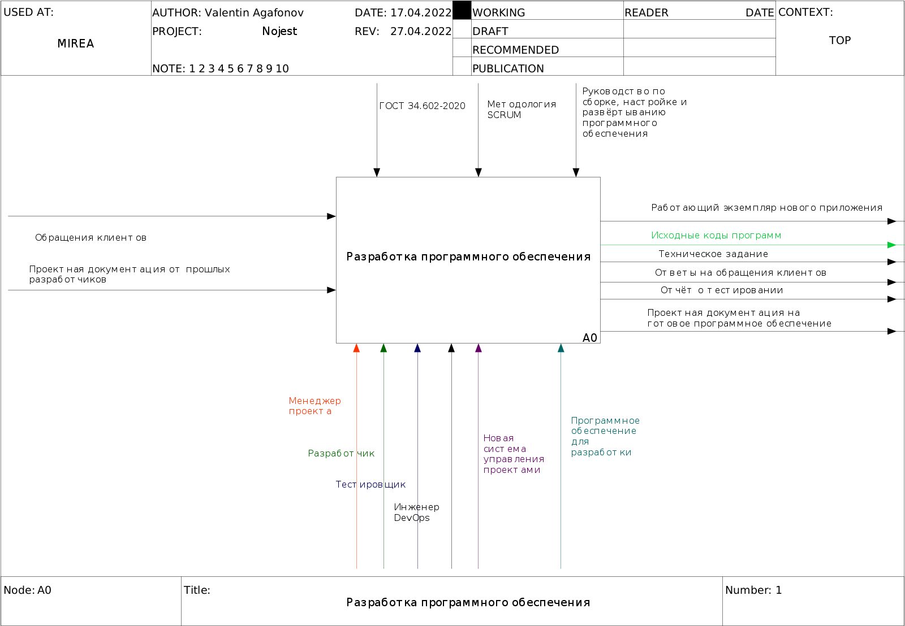
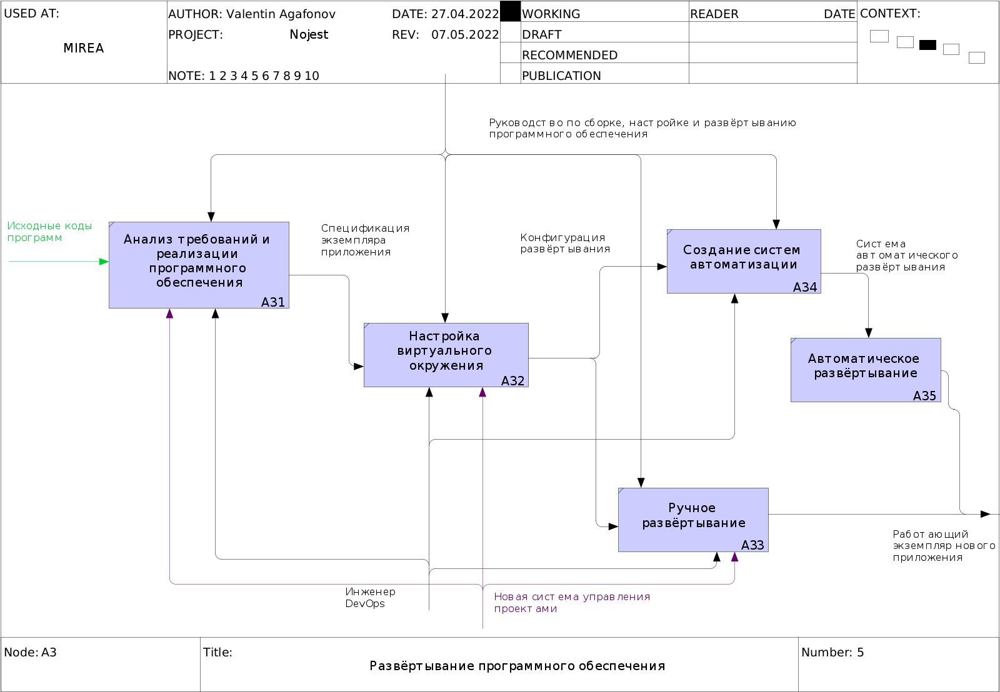

# 2 АНАЛИТИЧЕСКИЙ РАЗДЕЛ

## 2.1 Новая технология выполнения выбранной функции управления

Выполнение функции управления непосредственно связано с взаимодействием с системой управления проектами. Новое приложение призвано решить проблемы пользователей, которые возникали при работе в старой системе управления проектами. А именно:

* переключение внимания на неиспользуемые функции;
* трудоёмкость доработки системы под специфические требования организации;
* требование запуска системы и хранения данных на оборудовании организации.

Последнее требование обусловлено политикой информационной безопасности, которая может применяться в IT-компании. Человеческие ресурсы являются самым важным активом любой IT-компании. Это значит, что применяемые оптимизации бизнес-процесса должны быть в первую очередь направлены на снижение трудозатрат сотрудников. Для системного понимания недостатков юзабилити существующей системы управления проектами будет полезно рассмотреть подробнее процессы взаимодействия участников, а именно менеджера проекта, разработчика и тестировщика. Так как есть всего три роли, а количество сочетаний из трёх по два равно трём, следует рассмотреть каждую пару участников процесса отдельно.

**Менеджер проекта - разработчик**

Цикл разработки начинается с получения технического задания разработчиком от менеджера проекта. В некоторых случаях до начала разработки менеджер уточняет у разработчиков сложность реализации требований клиента для более точного планирования этапов и сроков. В ходе разработки менеджер консультирует программистов по вопросам, которые не были оговорены в техническом задании. Само техническое задание обновляется.
В конце цикла разработки менеджер пишет проектную документацию по стандарту компании, обращаясь за консультациями к разработчикам.

**Менеджер проекта - тестировщик**

После завершения логически значимого спринта менеджер передаёт новое программное обеспечение в тестирование. Тестировщик получает от менеджера техническое задание.

**Разработчик - тестировщик**

Тестировщик получает от разработчиков целевое программное обеспечение, в виде репозитория исходного кода и запущенного экземпляра приложения. В ходе тестирования тестировщик обращается за консультациями к разработчику. Выполнив тестирование каждой задачи, тестировщик отмечает её статус в системе управления проектами. Задачи, которые не прошли проверку назначаются разработчику.
Разработчик обращается к тестировщику по вопросам настройки тестовой среды и условиям воспроизведения найденных ошибок, если в отчёте о тестировании недостаточно информации.

В рассматриваемом бизнес-процессе основным риском является увеличение сроков разработки. Соблюдение планов можно считать метрикой успешности коллектива компании. Когда задачи и проекты выполняются вовремя, в команде присутствует доброжелательная атмосфера, что немаловажно для продуктивного труда. Ниже перечислены основные причины увеличения сроков.

* Недооценка сложности требований;
* Часто изменяющиеся требования;
* Недостаточное количество или компетенция разработчиков;
* Отсутствие автоматизации повторяющихся технологических процессов.

Часть проблем, связанных с оценкой сложности и изменениями требований, должны быть решены путём создания новой системы управления проектами, в которой взаимодействие между менеджером и разработчиком становится удобней. Если требования меняются реже чем завершаются спринты, то изменения могут быть успешно добавлены в следующие этапы разработки.

Проблемы количества и компетенции разработчиков, решаются построением новой кадровой политики. Руководитель организации должен уделять большое внимание на формирование сильной команды разработки. Кадровая политика может быть направлена как на поиск новых опытных компетентных разработчиков, так и на выращивание их в коллективе. Зачастую IT-компании комбинируют эти направления.

Практика показывает, что применение автоматизации технологических процессов сборки, настройки и развёртывания программного обеспечения положительно влияет на продуктивность компании. DevOps инженер является специалистом по автоматизации технологических процессов. Такая автоматизация снимает обязанности по сборке, настройке и развёртыванию с разработчика, что позволяет ему сфокусироваться на реализации требований технического задания. В крупных IT-компаниях специалисты по развёртыванию (или DevOps) могут быть включены в подразделение отдела администрирования, а в небольших эти функции берёт на себя отдел разработки. Помимо развёртывания DevOps оказывает помощь в автоматизации процесса тестирования, участвует в создании интеграционных, нагрузочных и регрессионных тестов. Циклическая технология работы DevOps показана на диаграмме (рисунок 2.1) от сообщества инженеров данной области.

Рисунок 2.1 Модель работы DevOps инженера

Пользовательский интерфейс новой системы управления проектами должен быть интуитивен и лаконичен т.е. состоять из минимального набора элементов необходимых для выполнения основного сценария использования. Это сохранит фокус внимания пользователя на важных аспектах взаимодействия и позволит избежать ошибок. Однако базовые принципы работы следует унаследовать от старой системы или любой другой популярной системы управления проектами т.к. в них прослеживается схожесть и большая часть пользователей уже имеет опыт работы в подобных системах. Если выполнение стандартных процедур в новой системе будет отличаться от привычного пользователям, то это обязательно вызовет отторжение, сотрудники будут просто игнорировать эти процедуры.

Новая система управления проектами должна быть качественно спроектирована с учётом инкрементальной модели разработки. Требуется выделить фундаментальные сущности логической модели данных и их программные интерфейсы, как неизменяемые в будущих версиях системы. Это поможет избежать трудозатрат при доработках системы. При выполнении этих доработок в будущем следует добавлять новые (менее значимые) сущности данных и их программные интерфейсы, а фундаментальные оставлять в неизменном виде.

Новая технология выполнения выбранной функции управления получила эволюционное развитие по сравнению со старой. Базовые принципы организации работ были сохранены так как их изменение могло вызвать трудности на этапе внедрения из-за необходимости переобучения сотрудников. Общий вид диаграммы новой модели бизнес-процессов (рисунок 2.2) демонстрирует, незначительные отличия от старой модели.

Рисунок 2.2 Общая схема процесса сопровождения разработки

В декомпозиции основного процесса (рисунок 2.3) голубым цветом показано добавление нового подпроцесса в технологический цикл: развёртывание программного обеспечения.

Рисунок 2.3 Декомпозиция основного процесса

Подпроцесс создания технического задания (рисунок 2.4) остался без изменений.

Рисунок 2.4 Декомпозиция процесса создания технического задания

Подпроцесс разработки в новой модели (рисунок 2.5) в качестве результата возвращает лишь исходные коды программ.

Рисунок 2.5 Декомпозиция процесса разработки

Подпроцесс развёртывания получает в качестве источников исходные коды программ, в качестве управления стандарты по развёртыванию, сборке и настройке. Результатом работы этого процесса являются работающие экземпляры разрабатываемых приложений. Внутренняя структура (рисунок 2.6) содержит первоначальный анализ задачи, настройку виртуального окружения для запуска разрабатываемого программного обеспечения и два альтернативных сценария разворачивания: ручной и автоматический. На практике, как правило, в опытной эксплуатации используется ручное развертывание, а промышленной применяется автоматизация. Работы по автоматизации можно разделить на создание систем для автоматического развертывания и их непосредственную эксплуатацию. Выполняемые в рамках развёртывания работы значительно зависят от технологического направления разработок компании. В данной работе подразумевается, что IT-компания занимается разработкой веб-сайтов.

Рисунок 2.6 Декомпозиция процесса развёртывания

Несмотря на относительно небольшие изменения в модели, новый способ выполнения бизнес-процесса способен значительно повлиять на успешность компании за счёт ускорения и повышения надёжности процесса разработки программного обеспечения. Таким образом приведённые модели новой технологии демонстрируют положительные изменения в выполнении бизнес-процесса, а именно:

* Увеличение удобства использования системы управления проектами
* Ускорение процесса разработки
* Разделение труда по более узким специализациям
* Снижение трудозатрат на переобучение для доработок системы управления проектами

# 2.2 Информационное обеспечение ИС

Информационное обеспечение — совокупность единой системы классификации и кодирования информации, унифицированных систем документации, схем информационных потоков, циркулирующих в организации, а также методология построения баз данных. От качества информационного обеспечения напрямую зависит качество программной архитектуры нового программного продукта. В данной работе рассмотрены информационные потоки, модель данных и классификаторы, используемые в прототипе системы управления проектами IT-компании.

# 2.2.1 Логическая модель данных и ее описание

Модель данных — это абстрактное, самодостаточное, логическое определение объектов, операторов и прочих элементов, в совокупности составляющих абстрактную машину доступа к данным, с которой взаимодействует пользователь. Упомянутые объекты позволяют моделировать структуру данных, а операторы — поведение данных.
Используя это определение, можно эффективно разделить понятия модели данных и её реализации.
Реализация (implementation) заданной модели данных — это физическое воплощение на реальной машине компонентов абстрактной машины, которые в совокупности составляют эту модель. [2.1 C 57]

Применяемые в современности модели данных и их реализации можно разделить на два больших класса: реляционные и нереляционные. Исторически первыми появились реляционные базы данных. Язык SQL, который первоначально назывался SEQUEL (Structured English QUEry Language), прошёл большой большой путь эволюционного развития за последние 50 лет. За счет простоты и выразительности язык SQL стал промышленным стандартом для почти всех реляционных баз данных. Сами данные в реляционных базах записываются в виде строк таблиц. Между таблицами строятся отношения (relations). Например, записи в таблице сообщений содержат идентификатор автора и таким образом ссылаются на записи в таблице пользователей, у каждого сообщения только один автор, у каждого пользователя может быть много сообщений, пользователи связаны с сообщениями отношением "один ко многим". Язык SQL позволяет в одном запросе обращаться сразу к нескольким таблицам. Например, запрос списка сообщение может возвращать не только идентификаторы, но и имена пользователей, которые находятся в другой таблице. Нереляционные базы данных стали широко распространены лишь в последнее десятилетие. Нереляционная база данных — это база данных, в которой в отличие от большинства традиционных систем баз данных не используется табличная схема строк и столбцов. В этих базах данных применяется модель хранения, оптимизированная под конкретные требования типа хранимых данных. Например, данные могут храниться как простые пары "ключ — значение", документы JSON или граф, состоящий из ребер и вершин. Эти оптимизации дают нереляционным базам данных неограниченные возможности по масштабированию за счёт распределённых вычислений. Но несмотря это преимущество, в разрабатываемом прототипе будет применяться традиционная для подобных систем реляционная модель, а в качестве системы управления базой данных выступит PostgreSQL.

Логическая модель базы данных необходима для понимания, как циркулируют данные в информационной системе. Эта модель строится проектировщиком, а используется разработчиком. Существует несколько нотаций для построения логической модели данных. Наиболее распространены нотации Питера Чена, Crows Foot, IDEF1X. В данной работе для визуализации логической модели используется нотация Crows Foot (рисунок 2.7) т.к. она проста в построении и достаточно наглядна. В этой нотации сущности показываются в виде прямоугольников, которые содержат заголовок с названием сущности и список полей ниже. Отношения между сущностями показываются в виде линий, соединяющих прямоугольники.

Рисунок 2.7 Логическая модель базы данных

Далее перечислены логические сущности, их общее описание и назначение в контексте всей системы. Более подробно реализация базы данных будет описана в пункте 4.4.

**Пользователь** (user)

Экземпляр этой сущности представляет собой учётную запись пользователя. Содержит профиль пользователя и служебные поля (хэш пароля и токен подтверждения электронной почты).

**Проект** (ject)

Проект программного обеспечения является единицей репрезентации результата работы компании. Содержит название, описание и статус.

**Версия** (version)

Так как в компании используется инкрементная модель разработки, у каждого проекта может быть несколько версий. Запись версии содержит название, описание и статус.

**Задача** (task)

Задача является небольшой частью работы по проекту, может состоять из вложенных подзадач. Таким образом формируется дерево задач по проекту. Сущность задачи связана с проектом, версией и пользователем отношениями типа один ко многим. Содержит название и описание. Статус задачи вынесен в отдельную сущность т.к. представляет интерес история его изменения.

**История статусов задачи** (task history)

История хранит записи о изменениях статусов задач, что полезно для анализа работы компании за прошлые периоды. Запись в истории содержит значение статуса, дату, время и идентификатор задачи. У одной задачи может быть множество записей в истории. Актуальный статус задачи определяется последним значением в истории.

**Сообщение** (message)

Сообщения используются для коммуникации между участниками разработки по рабочим задачам. Запись сообщения содержит непосредственно текст, дату, время, идентификаторы задачи и отправителя. По каждой задаче у каждого пользователя может быть множество сообщений.

**Роль** (role)

Данная сущность хранит в себе справочник ролей пользователей. Возможные значения: менеджер проекта, разработчик, тестировщик.

**Член проекта** (member)

Сущность определяет отношение между сущностью пользователь и проект т.е. сопоставляет множество пользователей и множество проектов. Введение этой сущности помогает избежать отношения многие ко многим.

**Роль члена проекта** (member role)

Сущность определяет отношение между сущностью роль и член проекта т.е. сопоставляет множество ролей и множество членов проекта. У каждого члена проекта может быть несколько ролей, а по каждой роли может быть несколько членов проекта. Введение этой сущности помогает избежать отношения многие ко многим.

**Документ**

С точки зрения системы управления проектами документ является стандартной формой деловой отчётности т.е. информационным продуктом. Документы служат для удобного обмена ключевой информацией по проектам. В проектируемом бизнес-процессе будут применяться следующие типы документов:

* Стандарты по проектированию, разработке, развёртыванию программного обеспечения
* Технические задания на проекты компании
* Проектная документация на проекты компании
* Проектная документация от сторонних разработчиков
* Отчёты о разработке и тестировании

Реализация современных облачных систем хранения данных весьма сложна и трудоёмка сама по себе. В рамках учебного проекта допускается использование готовой облачной системы с открытой лицензией. В роли этой системы выступает Nextcloud. В случае развития прототипа возможна интеграция с различными файловыми хранилищами.

Отношения в рассматриваемой модели нормализованы до третьей нормальной формы (НФ). Цель нормализации: исключить избыточное дублирование данных, которое является причиной аномалий, возникших при добавлении, редактировании и удалении записей. Отношение находится в 1НФ, если все его атрибуты являются простыми, все используемые домены должны содержать только скалярные значения. Отношение находится во 2НФ, если оно находится в 1НФ и каждый не ключевой атрибут неприводимо зависит от первичного ключа. Отношение находится в 3НФ, когда находится во 2НФ и каждый не ключевой атрибут нетранзитивно зависит от первичного ключа. На практике нормализация модели данных заключается в анализе сути рассматриваемых данных, поиске в них избыточности и разбиении модели на более простые сущности.

Перечисленные выше сущности являются фундаментальными для системы управления проектами. Это значит, что их название, назначение, поля (т.е. свойства объектов) и реализация не могут быть переопределены в дальнейшем. Все вспомогательные сущности, которые могут появиться при развитии системы, должны опираться на фундаментальные, не заменять их функции и не противоречить им. В процессе создания логической модели данных был проведён анализ уже существующих систем управления проектами. Использовались схемы баз данных приложений redmine и Jira. Применяемые в этих программах решения подверглись критическому анализу и наиболее удачные были заимствованы.

# 2.2.2 Используемые классификаторы и система кодирования

Классификатор – это сгруппированный, по различным признакам, перечень наименованных объектов, где каждому из них присвоен уникальный код, в соответствии с их общими признаками или различиями. Классификаторы применяются для упрощения работы по сбору информации и систематизации данных, а также используются для указания кодов в различных унифицированных документах. В контексте систем управления проектами ключевыми классификаторами являются идентификаторы проектов, задач по проектам и документов. Эти классификаторы и будут использоваться в прототипе системы. При добавлении функций системы возможно добавление новых классификаторов.
Кодирование – присвоение кода классификационной группировке или объекту классификации для обеспечения их однозначной идентификации в классификаторах в соответствии с выбранным методом кодирования с помощью знаков (символов) [2.4].

Классификатор «Идентификатор проекта» кодируется единственным уникальным значением, которое определяется автором проекта при его добавлении в систему. При добавлении нового проекта в систему помимо названия и описания указывается его код. Система помогает пользователю выбрать короткий, ещё не использовавшийся ранее код, который состоит из заглавных латинских букв. Максимальная длина кода проекта 64 символа, что соответствует ёмкости 3,6165×10⁹⁰, но на практике длинные коды применяются редко. В случае веб-студии разумным будет кодировать проекты по адресу сайта или названию бренда т.к. эти признаки тоже уникальные.

Пример: «WEBCHECKIN» – код проекта «Веб-регистрация»

Классификатор «Идентификатор задачи» составной иерархический, состоит из двух частей: код проекта и порядковый номер задачи. Важность этого классификатора сложно переоценить. Простота и удобство его использования положительно влияют на взаимодействие между участниками разработки. Несмотря на то, что во многих системах управления проектами используется сквозная нумерация задач по всем проектам (пример redmine), который проще в реализации, в новой системе было решено придерживаться схемы наименования, в которой идентификатор задачи содержит код проекта. Данный подход требует дополнительных разовых затрат при разработке, однако упрощает взаимодействие пользователя с системой, позволяет легко ориентироваться в списках задач (рисунок 2.7). Идентификатор задачи используется для формирования глубоких ссылок (или deeplink). Deeplink — это гиперссылка, которая перенаправляет пользователя на конкретную страницу сайта. Эта функция сокращает количество промежуточных действий пользователя и помогает ему попасть на нужную страницу за минимальное количество кликов. Ссылки на задачи часто появляются в переписках между сотрудниками и в отчётах. Максимальная длина порядкового номера составляет 9 знаков, что соответствует ёмкости в один миллиард задач на каждый проект. На практике достижение этого лимита маловероятно, а в случае если это произойдёт технические ограничения системы позволят увеличить его на один порядок. Незначащие нули в идентификаторе задачи игнорируются для краткости. А так как задачи в системе имеют древовидную структуру и применяется инкрементальная модель разработки в начале списке оказываются задачи, которые образуют основание дерева.

Пример: «WEBCHECKIN-565» – задача №565 в проекте «Веб-регистрация»

Рисунок 2.8 Пример поиска задачи в JIRA

Классификатор «Идентификатор документа» тоже составной иерархический, состоит из четырёх частей: код проекта, тип документа, дата и время создания, формат файла. Возможные типы документов: техническое задание, проектная документация, отчёт. Идентификатор документа применяется при создании файлов в качестве имени. Несмотря на поддержку облачным хранилищем возможности сохранять нескольких версий файла под одним именем, в классификаторе используется дата и время создания т.к. это упрощает дальнейшую работу с документами вне системы на персональных компьютерах сотрудников.

Пример: «WEBCHECKIN_PROJECT_REPORT_06052022_1632.pdf» – отчёт по проекту «Веб-регистрация», создан 6 мая 2022 в 16:32

Используемые коды типов документов:

* Технические задания - PROJECT_SPECIFICATION
* Проектная документация - PROJECT_DOCUMENTATION
* Отчёт о разработке и тестировании - PROJECT_REPORT

В разрабатываемом прототипе не будут применяться общегосударственные и отраслевые классификаторы из-за их отсутствия во входных и выходных данных предметной области. Однако не исключается возможность расширения функций новой информационной системы для которого потребуется использование внешних общепринятых классификаторов.

# 2.2.3 Нормативно-справочная и входная информация

Дать определение нормативно-справочной и входной информации, показать разницу.
Описать, что является нормативно-справочной, а что входной информацией во новой ИС.
Какие цели реализуются с помощью справочной информации (документы, справки и т.д.).
Показать макет экранной формы справочника (не заполненные поля без данных)
Показать макет экранной формы входной информации (не заполненные поля без данных)
Подробно описать входную информацию и плавно перейти к тому, как она будет преобразована выходную информацию.

# 2.2.4 Результатная информация

Описать, что является результатной информацией во новой ИС.
Отчёты, таблицы, документы, графики, экранные формы показать в виде макетов без данных.
Должна быть чёткая логическая связь с пунктом 2.2.3

# 2.3 Математическое обеспечение ИС

Дать определение математического обеспечения ИС с учётом понятия обеспечивающих подсистем.
Перечислить и описать все математические формулы, по которым проходят вычисления в ИС.
Не должно быть формул, которые не будут использоваться в ИС.
Использовать международный стандарт для оформления формул (файл 1200088826.pdf)

# 2.4 Техническое обеспечение ИС

Определения технического обеспечения с сылкой на источник.
Прототип ИС представляет собой клиент-серверное веб-приложение.
В качестве языка программирования был выбран Javascript, как для реализации сервера, так и для клиента.
Код клиента состоит из дерева React компонентов и Material UI.
Сервер работает на Node JS. Используется Веб-фреймворк Express. В качестве СУБД выбран PostgreSQL.
Деплой выполняется путём создания docker образа и запуска его в контейнере на сервере компании.

Выделить аппаратный комплекс, который необходим для работы прототипа ИС.
Можно указать конкретные марки/бренды оборудования, пояснить выбор.
Построить диаграмму IT-инфраструктуры.

================================

[2.1] К. Дж. Дейт. Введение в системы баз данных

В этом разделе повествование идёт о проектировании новой модели бизнес-процесса и приложения для него.
Веб-приложение реализующее:
signup,
login,
user-role,
user-profile,
issue-tracking (
 new-project,
 project-list,
 new-task,
 task-list,
 view-task,
 reports
)

В прототипе будет продемонстрирован базовый сценарий использования для всех ролей пользователей.
Помимо базового сценария могу сделать реализацию какого-нибудь специфического требования конкретной фирмы, чтобы показать гибкость прототипа.

Разрабатываемый прототип информационной системы, в случае успешной реализации, будет опубликован в учебном репозитории под открытой лицензией т.е. будущие выпускники смогут переиспользовать его пользовательские интерфейсы для реализации других информационных систем.
