# ТЕХНОЛОГИЧЕСКИЙ РАЗДЕЛ

## 4.1 Обоснование выбора средств разработки прототипа

## 4.1.1 Обоснование выбора среды разработки клиентской части прототипа

Разрабатываемая система является веб-приложением, клиент приложения работает через браузер, поэтому неизбежно применение веб-технологий. Браузер при рендере страниц приложения выступает в роли интерпретатора языков HTML, CSS, JS. Результатом интерпретации становится DOM (document object model), визуальной репрезентацией которого и является страница в окне браузера. Однако при разработке могут применяться другие языки программирования и препроцессоры, которые на этапе сборки генерируют код HTML, CSS, JS для браузера. Такой подход позволяет писать меньше кода и более удобно применять паттерны проектирования. Чтобы выбрать подходящий язык программирования следует провести небольшой анализ популярности разных языков т.к. в случае расширения команды разработки будет легче найти специалистов более по популярному языку.

Рейтинг RedMonk (рисунок 4.1) строится на основе популярности языка в GitHub и Stack Overflow [4.1]. Помимо JavaScript клиент приложения может быть написан на TypeScript или Dart. Остальные языки редко применяются для генерации пользовательского интерфейса в браузере. Язык TypeScript успешно применяется для создания сложных систем в больших командах разработки. Он позволяет добавить в код на JavaScript строгое определение типов, что положительно влияет на качество кода и снижает сложность поддержки больших проектов. Проекты на JavaScript могут быть относительно легко переписаны на TypeScript [4.2].

Рисунок 4.1 Рейтинг языков программирования RedMonk

В качестве языка программирования был выбран Javascript. Используется библиотека React, которая коренным образом меняет парадигму разработки за счёт внедрения понятия VirtualDOM (virtual document object model) и языка JSX. Язык JSX по синтаксису подобен HTML, но интерпретируется на уровне препроцессора (по умолчанию используется препроцессор Babel). Препроцессор переводит конструкции JSX в объекты VirtualDOM библиотеки React. Вспомогательная библиотека ReactDOM преобразует и синхронизирует состояние VirtualDOM в DOM браузера. Описанный выше подход, несмотря на свою сложность, решает множество проблем в разработке современных пользовательских интерфейсов. Клиент современного веб-приложения должен обрабатывать поток событий от пользователя, получать актуальное состояние с сервера и передавать изменения состояния на сервер. До появления библиотеки React попытки реализовать эти три требования в одной программе приводили либо к ошибкам из-за коллизий в обработке событий после изменения состояния, либо к значительному росту сложности алгоритма и его поддержки. С появлением React стало возможным применение функциональной парадигмы программирования т.е. весь пользовательский интерфейс стал возвращаемым значением чистой функции, которая зависит только от состояния. При этом управление состоянием не входит в задачи библиотеки React, для этого применяются специальные библиотеки менеджеры состояния (state management). Главная функция (как правило называется App) внутри себя вызывает функции второго порядка для отдельных частей пользовательского интерфейса. Такие функции, которые возвращают JSX, принято называть компонентами. Современные приложения на React могут состоять из тысяч компонентов, выстроенных в единое дерево.

Так как разрабатывается прототип приложения объем исходных кодов невелик относительно конечной реализации системы. На данном этапе остаётся открытым вопросом возможность финальной реализации клиента приложения на TypeScript.

Достоинства TypeScript:

* Позволяет быстрее и проще писать сложные приложения
* Обнаружение ошибок в коде во время компиляции
* Хорошая интеграция с современными средами разработки

Недостатки TypeScript:

* Снижает скорость разработки для простых приложений
* Требует компиляции, что замедляет сборку
* Требует глубокого изучения для написания качественного кода

Значительное влияние на выбор языка программирование оказал прошлый опыт исполнителя данной работы. Помимо клиента приложения на JavaScript реализован и сервер. Это решение было принято чтобы снизить нагрузку на единственного разработчика и уложиться в сроки. Недостаток решения — относительно низкая производительность. За счёт лаконичности и выразительности исходные коды на JavaScript легки для понимания программистами, которые специализируются серверной части (Java, C#, C++, Python) и могут быть переписаны на эти языки. Компромиссным решением проблемы производительности может стать выделение часто вызываемых частей приложения (так называемых горячих участков кода) в отдельные модули и реализация их алгоритмов на низкоуровневых языках программирования.

В разработке приложений программисты используют интегрированную среду разработки (Integrated development environment — IDE). Эта программа совмещает в себе текстовый редактор, транслятор (компилятор и/или интерпретатор), отладчик, средства сборки и множество других полезных инструментов (рисунок 4.2). Современные IDE поддерживают установку расширений из своих репозиториев и расширений пользователей. Как правило выбор конкретной IDE делает непосредственно разработчик, учитывая область применения, язык программирования и личные предпочтения. Разрабатываемый прототип не накладывает никаких ограничений на выбор IDE, исходные коды могут быть открыты, изменены и запущены в любой современной IDE, которая предназначена для веб-приложений. Это может быть VS Code, WebStorm или Notepad. Для сборки и запуска в режиме разработки используется инструмент create-react-app. Данный инструмент является консольной программой, которая имеет интеграцию с многими средами разработки.

Рисунок 4.2 Среда разработки VS Code

## 4.1.2 Обоснование выбора СУБД

СУБД — это комплекс программных средств, предназначенный для создания, ведения и совместного использования данных пользователями. СУБД различают по используемой модели данных. Разрабатываемый прототип базируется на использовании реляционной модели данных, поэтому далее будут рассмотрены ре­ляционные СУБД. Подобно выбору языка программирования предпочтителен выбор более популярной СУБД при прочих равных критериях. В настоящее время наиболее распространены:

* Oracle
* MS SQL Server
* PostgreSQL
* MySQL

Каждая из приведенных СУБД обладает индивидуальными особенностями, преимуществами и недостатками, сравнение которых приведено ниже. Oracle является старейшей СУБД, разрабатываемой с 1979 г. В настоящее время Oracle обладает рядом уникальных технологий, обеспечивающих ей конкурентное преимущество. Как признанный лидер в этой отрасли производства программного обеспечения Oracle владеет почти половиной мирового рынка систем управления базами данных.

СУБД MS SQL Server, так же как и СУБД Oracle, можно отнести к СУБД промышленного уровня. СУБД MS SQL Server обладает широким спектром функциональных возможностей и по своей производительности нисколько не уступает СУБД Oracle. В ряде случаев в качестве СУБД лучше использовать MS SQL Server, как продукт компании Microsoft. Например, если проект написан с использованием технологий Microsoft, в частности на сервере используется операционная система Windows Server или среда разработки .Net, альтернативы MS SQL Server может не быть.

Основное отличие MySQL от СУБД промышленного уровня состоит в том, что MySQL предназначена для решения узкого круга задач. В свою очередь, СУБД промышленного уровня не имеют ограничений в применении, начиная от простой базы данных, обслуживающих сайт или небольшую компанию, и заканчивая огромными мощными хранилищами данных.

Преимуществом PostgreSQL перед MySQL является попытка максимально соответствовать стандарту SQL с реализацией самых новых стандартов, что значительно расширяет функциональные возможности данной СУБД. [4.3 c 3]

Для полноценного обоснования выбора СУБД были выделены следующие критерии:

* стоимость
* функциональные возможности
* производительность
* кроссплатформенность

_ | Oracle | MS SQL Server | PostgreSQL | MySQL
------ | ------ | ------ | ------ | ------ | ------
Лицензия | Коммерческая | Коммерческая | Открытая | Открытая
Стабильность | + |  + | + | +
Популярность | + | + | + | +
Масштабируемость | Вертикальная | Вертикальная, комплексная | Вертикальная | Вертикальная, комплексная
Сложность обучения | Значительная | Значительная | Значительная | Средняя
Параллельный доступ | + | + | + | +
Linux | + | - | + | +
Windows | + | + | + | +

Сравнительный анализ производительности различных СУБД в рамках данной работы не проводился т.к. это сопряжено с большим количеством факторов которые должны учитываться в бенчмарке (тестовый набор данных, версии СУБД, операционные системы, используемое оборудование). Однако независимые источники утверждают, что СУБД Oracle имеет незначительное преимущество по быстродействию перед остальными СУБД. [4.4]
Наиболее подходящей СУБД с приоритетом, ориентированным на стоимость и характеристики, является свободно распространяемая СУБД PostgreSQL. Именно она была выбрана для реализации базы данных в разрабатываемом прототипе.

## 4.2 Дерево функций и сценарий диалога прототипа

Функциональность системы представлена в виде рисунка дерева функций, на котором в иерархическом виде представлены все функции разрабатываемого прототипа. В качестве отправной точки построения этого дерева выступили функциональные требования из постановки задачи на разработку прототипа. Все функции можно разделить на служебные (регистрация, авторизация, редактирование профиля, выход из системы) и основные, то есть такие, которые описывают порядок выполнения основного назначения информационной системы. Кроме того, присутствуют функции по составлению и получению отчетов и специальная функция глобального текстового поиска.

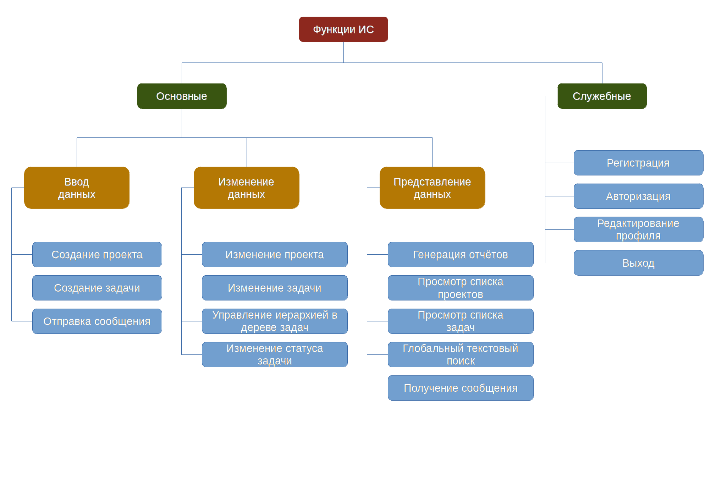
Рисунок 4.3 Дерево функций прототипа

Сценарием диалога называется последовательность вопросов и ответов, которыми обмениваются пользователь и ЭВМ в ходе решения задачи. Исторически первым был текстовый диалог между человеком и компьютером. Позже появился графический режим взаимодействия. Текстовый диалог применяется и сейчас, причём во многих аспектах он более удобен, чем визуальный. В современных системах управления проектами стандартом считается графический диалог построенный на веб-технологиях.

Сценарии диалогов служебных функций одинаковы для всех ролей пользователя. Регистрация пользователя в системе реализована классическим способом: ввод данных пользователя, отправка формы регистрации, подтверждение адреса электронной почты. Диалог авторизации запрашивает у пользователя логин и пароль, после чего отвечает на запрос авторизации успехом или сообщением об ошибке. Для редактирования профиля пользователь меняет значения в текстовых полях, отправляет форму, система сохраняет профиль в базе данных. Выход из системы осуществляется кликом по соответствующей кнопке.

Диалог создания проекта проекта доступен только для пользователей с правами администратора. В этом диалоге пользователь заполняет поля проекта, отправляет форму, система записывает новый проект в базу данных. Диалог создания задачи доступен для всех ролей пользователей. Чтобы завести новую задачу пользователь вводит её данные и отправляет форму, система записывает новую задачу в базу данных. Отправка и получение сообщений по задачам реализовано в виде привычного для пользователей чата. В этом диалоге система выступает промежуточным звеном между пользователями: один пользователь пишет сообщение в поле ввода и отправляет его, система получает, записывает в базу данных и уведомляет всех подписанных на обновление состояния клиентов приложения, другой пользователь видит новое сообщение по задаче. Изменение проекта и задачи выполняется подобно созданию. Управление иерархией в дереве задач возможно через два диалога: изменением идентификатора родительской задачи и перетаскиванием с помощью мышки.

Диалог генерации отчётов доступен всем ролям пользователей. Для генерации отчёта пользователь указывает в форме параметры отчёта (проект, версию проекта, статус задач, исполнителя задач, даты, тип, формат отчета) и отправляет форму, система генерирует отчёт по переданным параметрам и возвращает результат. Просмотр списка проектов доступен пользователю без дополнительных манипуляций, достаточно открыть страницу. Диалог просмотра списка задач подобен генерации отчётов, пользователь требуется указать интересующие его параметры списка задач и отправить форму. Глобальный текстовый поиск реализуется через диалог поисковой строки. Не смотря на визуальное представление этот сценарий взаимодействия с пользователем наследует принципы построения текстового диалога. Чтобы найти нужную информацию в системе пользователь вводит текст запроса в поле поиска, система получает текущее значение поисковой строки и предлагает, отсортированные по релевантности, подсказки.

## 4.3 Описание динамических аспектов функционирования прототипа
Построить UML диаграмму последовательностей
Диаграмму состояний деятельности

## 4.4 Реализация базы данных прототипа

## 4.4.1 Физическая модель данных

Физическая модель базы данных — это модель данных, которая определяет, каким образом представляются данные, и содержит все детали, необходимые СУБД для создания базы данных. То есть физическая модель является реализацией логической модели, которая была подробно рассмотрена в пункте 2.2.1 данной работы.
Модель ANSI-SPARC (рисунок 4.8) описывает принцип построения СУБД как три уровня абстракции:

* Внешний (пользовательские представления)
* Концептуальный (логическая модель)
* Внутренний (физическая реализация)

Рисунок 4.8 Схема архитектуры ANSI-SPARC

Этот подход позволяет разделить пользовательское и физическое представление базы данных. Пользовательские представления одних и тех же данных могут различаться т.к. каждое представление может быть описано своим форматом, необходимом пользователю. Концептуальный уровень описывает сущности данных и отношения между ними. Внутренний уровень определяет физическое представление базы данных в памяти компьютера, позволяет проводить оптимизации производительности и потребления ресурсов.

В прототипе физическая реализация внутреннего уровня абстракции выполнена внутри СУБД PostgreSQL. То есть выходит за рамки ответственности разработчика прототипа. Тем не менее понимание принципов внутреннего устройства PostgreSQL позволяет использовать этот инструмент более полно и осуществлять тонкую настройку.

Каждый запрос к СУБД проходит следующие этапы для получения результата:

1. Подключение к серверу PostgreSQL

2. Синтаксическая проверка запроса и создание *дерева запроса*

3. Поиск в системных каталогах правила для применения к *дереву запроса*

4. Преобразования, заданные в теле каждого правила

5. Создание плана запроса

6. Рекурсивное выполнение *дерева запроса* и возврат результата

Для инициализации один клиентский процесс подключается к одному отдельному серверному процессу. Так как не известно заранее количество подключений, главный процесс запускает новый процесс при каждом запросе подключения. Главный процесс называется postgres и принимает входящие подключения в заданном порту TCP/IP. Получив запрос на подключение, процесс postgres порождает новый серверный процесс. Серверные задачи взаимодействуют между собой через семафоры и разделяемую память, чтобы обеспечить целостность данных при одновременном обращении к ним. [4.5]

При разборе проверяется сначала синтаксис строки запроса (поступающей в виде неструктурированного текста). Если он правильный, строится *дерево запроса* и передаётся дальше, в противном случае возвращается ошибка. Лексический и синтаксический анализ реализован с применением средств Unix bison и flex. Затем дерево разбора создаётся только с фиксированными знаниями о синтаксической структуре SQL. При его создании не просматриваются системные каталоги, что не даёт возможность понять конкретную семантику запрошенной операции. После этого выполняется процедура преобразования, которая принимает дерево разбора от анализатора и выполняет семантический анализ, необходимый для понимания, к каким именно таблицам, функциям и операторам обращается запрос. Структура данных, которая создаётся для представления этой информации, называется *деревом запроса*.

PostgreSQL поддерживает мощную систему правил для создания представлений и возможности изменения представлений. В современных версиях PostgreSQL применяется так называемое переписывание запроса. Система переписывания реализована в механизме, внедрённом между анализатором и *планировщиком/оптимизатором*.

*Планировщик/оптимизатор* строит наилучший план выполнения. Один SQL-запрос можно выполнить разными способами, с одинаковыми результатами. Если это не требует больших вычислений, оптимизатор запросов будет перебирать все возможные варианты планов, чтобы в итоге выбрать тот, который должен выполниться быстрее остальных. Если рассмотрение всех возможных вариантов выполнения запросов занимает слишком много времени и памяти PostgreSQL использует генетический оптимизатор запросов.

Исполнитель принимает план и обрабатывает его рекурсивно, чтобы получить требуемый набор строк. Обработка выполняется по конвейеру, с получением данных по требованию. При вызове любого узла плана он должен выдать очередную строку, либо сообщить, что выдача строк завершена. [4.5]

С полученными знаниями о физической реализации СУБД PostgreSQL был составлен список сущностей логической модели. В таблице ниже перечислены сущности, их поля, и отмечены связи между ними.

<table>

  <tr>
    <th align="left">nj_user</th>
    <th align="left">Пользователь</th>
  </tr>
  <tr>
    <td>id <b>*</b></td>
    <td>Идентификатор</td>
  </tr>
  <tr>
    <td>full_name</td>
    <td>Полное имя</td>
  </tr>
  <tr>
    <td>phone_number</td>
    <td>Номер телефона</td>
  </tr>
  <tr>
    <td>email</td>
    <td>Электронная почта</td>
  </tr>
  <tr>
    <td>email_confirmed</td>
    <td>Признак подтверждения почты</td>
  </tr>
  <tr>
    <td>email_confirm_token</td>
    <td>Токен подтверждения почты</td>
  </tr>
  <tr>
    <td>password_hash</td>
    <td>Хэш пароля</td>
  </tr>
  <tr>
    <td>avatar</td>
    <td>Фотография</td>
  </tr>

  <tr>
    <th align="left">nj_ject</th>
    <th align="left">Проект</th>
  </tr>
  <tr>
    <td>id <b>*</b></td>
    <td>Идентификатор</td>
  </tr>
  <tr>
    <td>code</td>
    <td>Кодификатор</td>
  </tr>
  <tr>
    <td>title</td>
    <td>Название</td>
  </tr>
  <tr>
    <td>description</td>
    <td>Описание</td>
  </tr>
  <tr>
    <td>status</td>
    <td>Статус</td>
  </tr>

  <tr>
    <th align="left">nj_document</th>
    <th align="left">Документ</th>
  </tr>
  <tr>
    <td>id <b>*</b></td>
    <td>Идентификатор</td>
  </tr>
  <tr>
    <td>ject_id <b>**</b></td>
    <td>Идентификатор проекта</td>
  </tr>
  <tr>
    <td>document_author_id <b>**</b></td>
    <td>Идентификатор автора</td>
  </tr>
  <tr>
    <td>url</td>
    <td>Адрес ресурса</td>
  </tr>

  <tr>
    <th align="left">nj_member</th>
    <th align="left">Член проекта</th>
  </tr>
  <tr>
    <td>id <b>*</b></td>
    <td>Идентификатор</td>
  </tr>
  <tr>
    <td>ject_id <b>**</b></td>
    <td>Идентификатор проекта</td>
  </tr>
  <tr>
    <td>user_id <b>**</b></td>
    <td>Идентификатор пользователя</td>
  </tr>

  <tr>
    <th align="left">nj_role</th>
    <th align="left">Роль</th>
  </tr>
  <tr>
    <td>id <b>*</b></td>
    <td>Идентификатор</td>
  </tr>
  <tr>
    <td>name</td>
    <td>Название</td>
  </tr>
  <tr>
    <td>code</td>
    <td>Код</td>
  </tr>

  <tr>
    <th align="left">nj_member_role</th>
    <th align="left">Роль члена проекта</th>
  </tr>
  <tr>
    <td>id <b>*</b></td>
    <td>Идентификатор</td>
  </tr>
  <tr>
    <td>role_id <b>**</b></td>
    <td>Идентификатор роли</td>
  </tr>
  <tr>
    <td>member_id <b>**</b></td>
    <td>Идентификатор члена проекта</td>
  </tr>

  <tr>
    <th align="left">nj_version</th>
    <th align="left">Версия проекта</th>
  </tr>
  <tr>
    <td>id <b>*</b></td>
    <td>Идентификатор</td>
  </tr>
  <tr>
    <td>ject_id <b>**</b></td>
    <td>Идентификатор проекта</td>
  </tr>
  <tr>
    <td>title</td>
    <td>Название</td>
  </tr>
  <tr>
    <td>description</td>
    <td>Описание</td>
  </tr>
  <tr>
    <td>status</td>
    <td>Статус</td>
  </tr>

  <tr>
    <th align="left">nj_task</th>
    <th align="left">Задача</th>
  </tr>
  <tr>
    <td>id <b>*</b></td>
    <td>Идентификатор</td>
  </tr>
  <tr>
    <td>title</td>
    <td>Название</td>
  </tr>
  <tr>
    <td>description</td>
    <td>Описание</td>
  </tr>
  <tr>
    <td>ject_id <b>**</b></td>
    <td>Идентификатор проекта</td>
  </tr>
  <tr>
    <td>task_author_id <b>**</b></td>
    <td>Идентификатор автора задачи</td>
  </tr>
  <tr>
    <td>contractor_id <b>**</b></td>
    <td>Идентификатор исполнителя</td>
  </tr>
  <tr>
    <td>deadline</td>
    <td>Срок выполнения</td>
  </tr>
  <tr>
    <td>parent_id <b>**</b></td>
    <td>Идентификатор родительской задачи</td>
  </tr>
  <tr>
    <td>target_version_id <b>**</b></td>
    <td>Идентификатор версии проекта</td>
  </tr>

  <tr>
    <th align="left">nj_task_message</th>
    <th align="left">Сообщение</th>
  </tr>
  <tr>
    <td>id <b>*</b></td>
    <td>Идентификатор</td>
  </tr>
  <tr>
    <td>task_id <b>**</b></td>
    <td>Идентификатор задачи</td>
  </tr>
  <tr>
    <td>date_time</td>
    <td>Дата и время отправки</td>
  </tr>
  <tr>
    <td>author_id <b>**</b></td>
    <td>Идентификатор отправителя</td>
  </tr>
  <tr>
    <td>letter</td>
    <td>Текст сообщения</td>
  </tr>

  <tr>
    <th align="left">nj_task_history</th>
    <th align="left">История задачи</th>
  </tr>
  <tr>
    <td>id <b>*</b></td>
    <td>Идентификатор</td>
  </tr>
  <tr>
    <td>task_id <b>**</b></td>
    <td>Идентификатор задачи</td>
  </tr>
  <tr>
    <td>date_time</td>
    <td>Дата и время изменения</td>
  </tr>
  <tr>
    <td>status</td>
    <td>Статус задачи</td>
  </tr>

</table>

Поля, которые отмечены символом <b>*</b>, являются первичными ключами (SERIAL PRIMARY KEY). Поля, которые отмечены <b>**</b>, являются ссылками на другие сущности. Инициализация структуры таблиц базы данных происходит по обращению к файлу *init.sql*. Название каждой сущности содержит префикс *nj* (сокращение от названия прототипа "nojest"). Применение подобных префиксов упрощает резервное копирование, восстановление, и интеграцию с другими приложениями за счёт определения пространства имён прототипа.

## 4.4.2 Инструкции на выборку данных для прототипа

Сервер приложения с одной стороны реализует API для чтения и записи данных клиентом, и сам является клиентом СУБД с другой стороны. Для обращения к СУБД сервер традиционно использует язык SQL и библиотеку node-postgres. Все инструкции на запись и выборку данных сервером размещаются в директории *server/models*. Методы моделей, предназначенные для выборки данных, похожи между собой т.к. построены по одному паттерну. Они принимают аргументы для поиска данных и возвращают объект Promise, который завершается успехом в случае получения данных и ошибкой в случае если СУБД не вернула результат.

Метод findUserByEmail (рисунок 4.9) возвращает информацию о пользователе по его адресу почты.

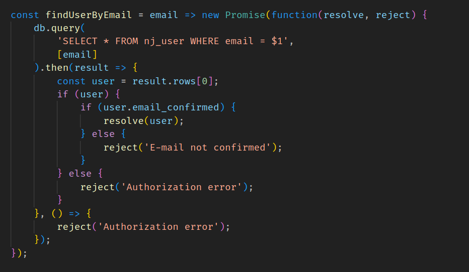
Рисунок 4.9 Листинг метода findUserByEmail

Метод getUsersList (рисунок 4.10) возвращает справочник пользователей.

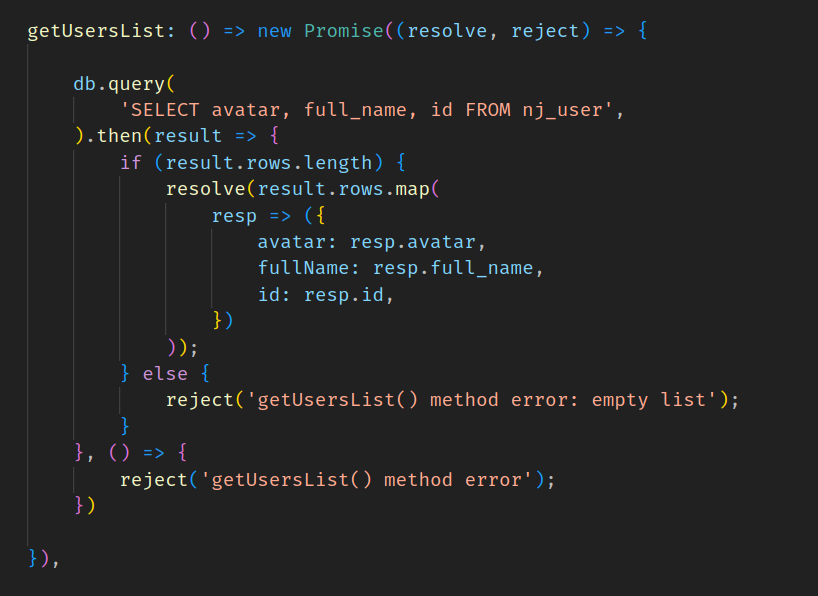
Рисунок 4.10 Листинг метода getUsersList

Метод activation (рисунок 4.11) в случае успешного поиска по токену записывает обновлённое состояние учётной записи в базу данных.

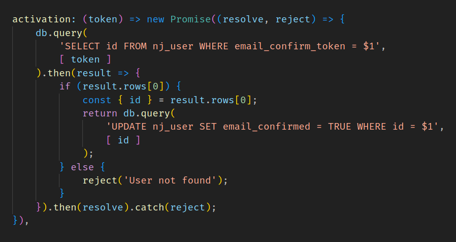
Рисунок 4.11 Листинг метода activation

Метод getJectWithTasks (рисунок 4.12) запрашивает у СУБД информацию о проекте по его идентификатору и дополняет ответ результатом работы метода getActualTasksByJect.

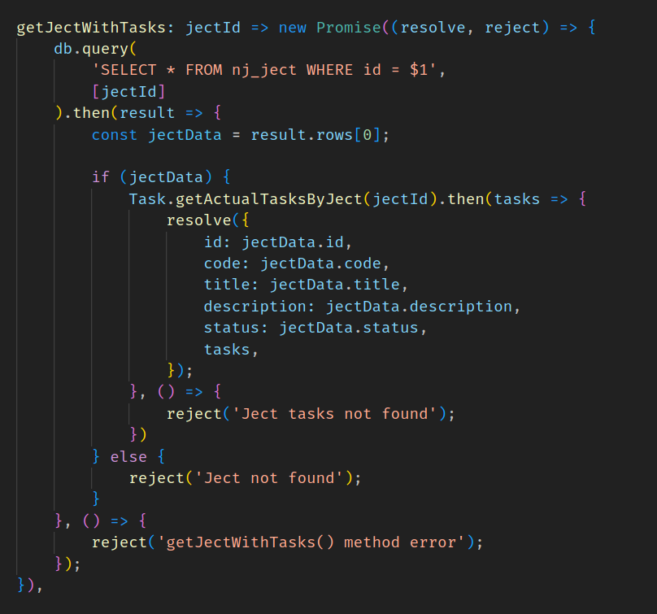
Рисунок 4.12 Листинг метода getJectWithTasks

Метод getActualTasksByJect (рисунок 4.13) возвращает список задач по переданному идентификатору проекта.

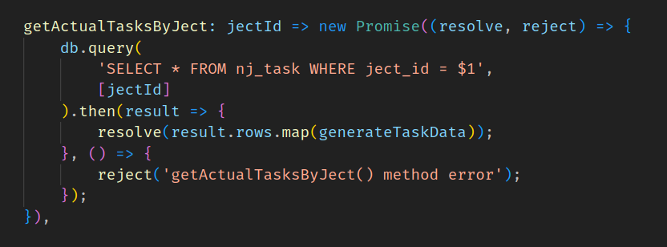
Рисунок 4.13 Листинг метода getActualTasksByJect

## 4.5 Описание пользовательского интерфейса прототипа

Функции прототипа с точки зрения пользовательского интерфейса реализуются как связанный список экранных форм. Одни формы содержат или вызывают другие. Некоторые из этих форм уже были продемонстрированы постановке задачи т.к. применялось эволюционное прототипирование их функциональность была неполной. С каждой итерацией разработки функциональность экранных форм приближается к итоговой.

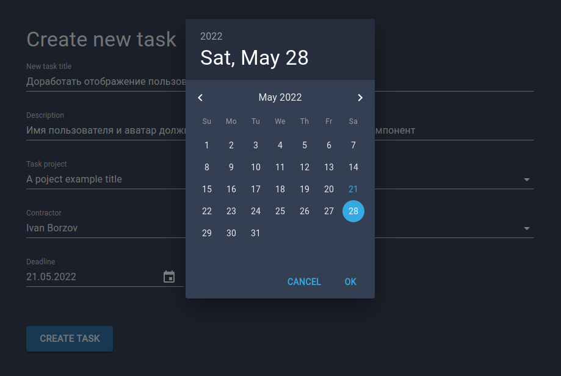
Рисунок 4.14 Экранная форма выбора даты

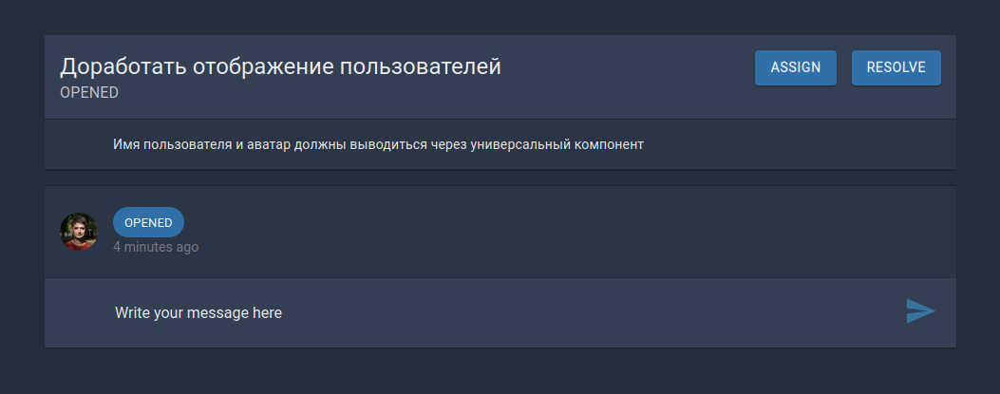
Рисунок 4.15 Экранная форма созданной задачи

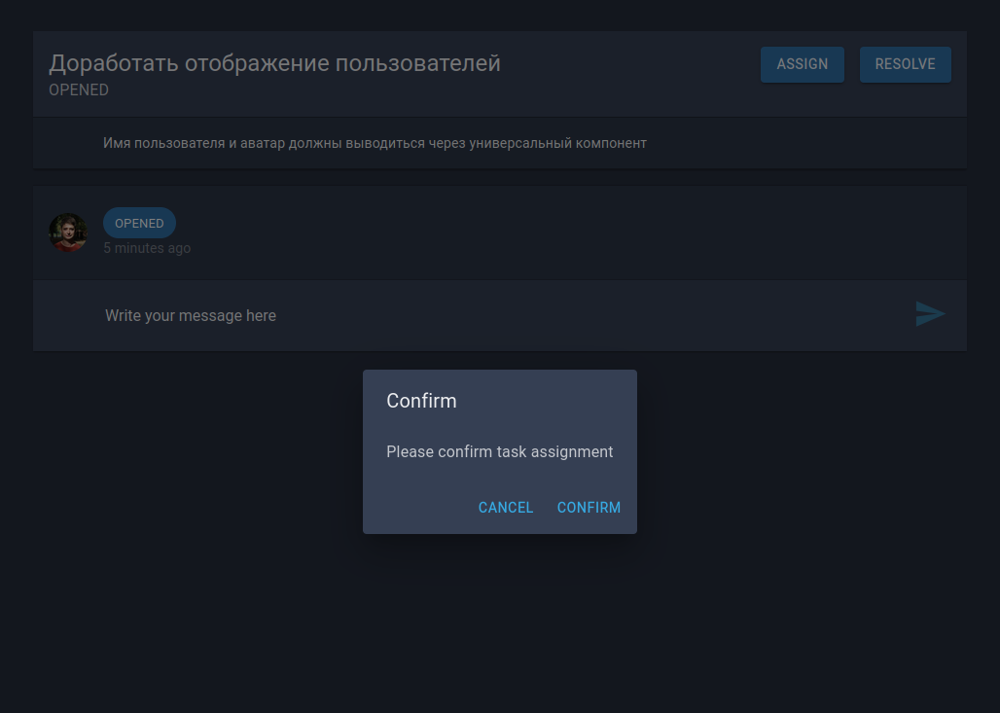
Рисунок 4.16 Экранная форма подтверждения смены статуса

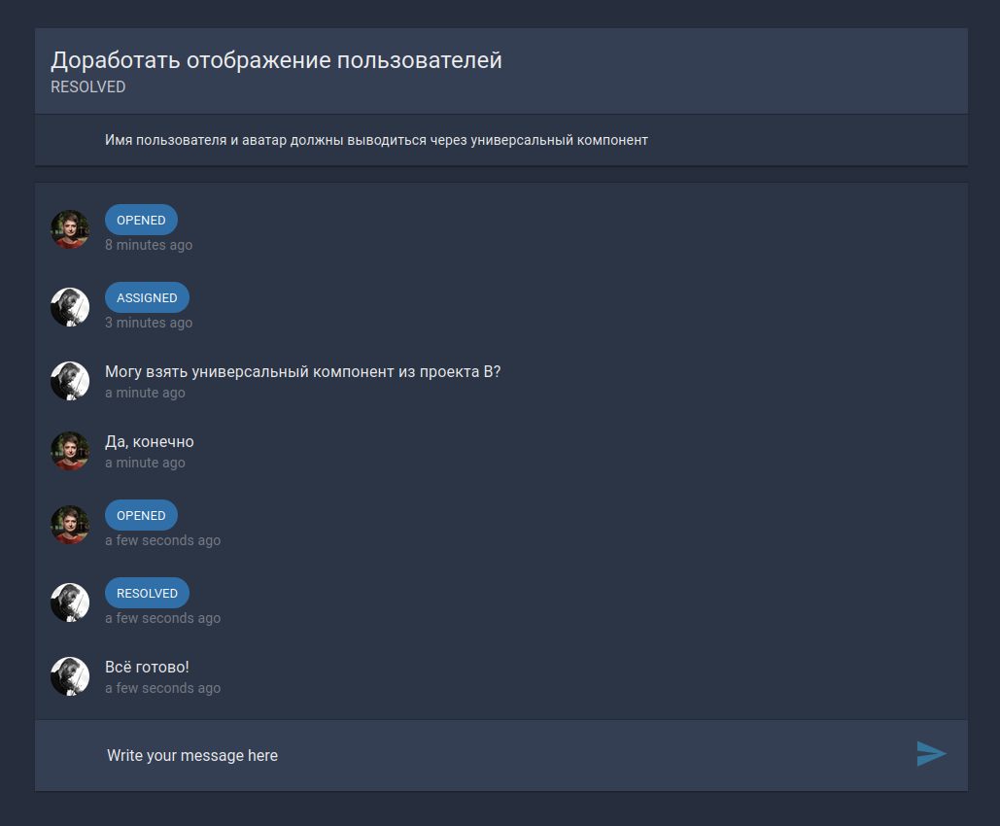
Рисунок 4.17 Экранная форма чата по задаче

## 4.6 Обеспечение информационной безопасности прототипа

Информационная безопасность — направление деятельности по предотвращению несанкционированного доступа, использованию, раскрытию, искажению, изменению, исследованию, записи или уничтожению информации. От внимания к этому направлению зависит и экономическая эффективность и репутация компании. В данной работе уже были рассмотрены аспекты комплексной безопасности типовой IT-компании. Для успешного противостояния внешним угрозам в компании требуется создать нормативно-распорядительные документы и придерживаться этих предписаний в работе каждого сотрудника.

Ключевыми документами для обеспечения информационной безопасности являются:

* Правила работы пользователей в корпоративной сети компании.
* Политика и регламент резервного копирования и восстановления данных.
* Комплексный план защиты информационных ресурсов компании от несанкционированного доступа.
* Политика установки обновлений программного обеспечения.

Для обеспечения информационной безопасности разрабатываемого прототипа было проведено исследование возможных угроз по типу разрабатываемого ПО и по типу используемых технологий. База данных системы управления проектами содержит ценную и зачастую секретную информацию о деятельности организации. Ни утрата, ни разглашение этих данных недопустимы. Перед запуском системы в промышленную эксплуатацию обязательно выполнение аудита сервера приложения. Все найденные уязвимости должны быть устранены до внедрения. Выбор места физического хранения данных является важным аспектом информационной безопасности. Облачное хранилище документов NextCloud, которое используется как модуль информационной системы, позволяет размещать базу данных и файловое хранилище на той же реальной или виртуальной машине, что и основной модуль прототипа. Используемые инструменты позволяют делать резервное копирование и восстановление БД прототипа и БД NextCloud.

Другое направление угроз при разработке прототипа происходит из устанавливаемых библиотек в виде NPM пакетов. Это направление появилось недавно. Как правило, разработчики популярных библиотек придерживаются этических принципов свободного и открытого программного обеспечения. Однако случаются неприятные инциденты. Существует большой список скомпрометированных NPM пакетов toxic-repos. [4.6]
Помимо непосредственных зависимостей проекта, уязвимости могут содержать зависимости используемых библиотек. Так сервер приложения содержит всего 9 подключаемых библиотек, но полный список устанавливаемых зависимостей содержит 142 NPM пакета. Вредоносный код зараженного NPM пакета может перезаписывать файлы на компьютере с проектом, добавлять контент от злоумышленников в разрабатываемое приложение. Угрозу такого рода сложно недооценить.

Для минимизации рисков по этому направлению были проведены мероприятия:
* Анализ исходных кодов подключаемых библиотек.
* Проверка подключаемых пакетов по списку опасных пакетов.

Некоторая часть исходных кодов библиотек была внимательно изучена и проверена. Общий объем кода библиотек сервера приложения 13 Mb, клиента - 226 Mb. Прочитать и провести аудит в рамках ВКР не представляется возможным. Анализом и верификацией библиотек занимается отечественное сообщество JavaScript разработчиков. Практикующим программистам следует следить за публикациями в этой области и принимать меры по замене скомпрометированных пакетов на надёжные.

Задача проверки подключаемых пакетов по списку toxic-repos была выполнена в виде короткой программы *check-dependencies*. Механизм проверки:

* загрузка списка toxic-repos
* преобразование дерева зависимостей package-lock.json в плоский список
* сравнение всех элементов одного списка со всеми элементами другого списка
* вывод отчёта в консоль

После запуска программа *check-dependencies* показала (рисунок 4.18), что подключаемые библиотеки сервера приложения не содержат опасных пакетов, а среди библиотек клиента нашелся один опасный пакет **es5-ext** версии 0.10.60 от 2022-04-07. Этот пакет был скомпрометирован 2022-03-29. Для устранения уязвимости был установлен пакет **es5-ext** версии 0.10.53 от 2019-11-21 (рисунок 4.19).

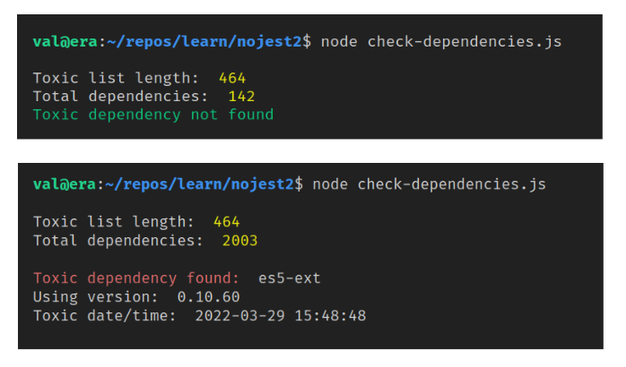
Рисунок 4.18 Отчёт выполнения программы check-dependencies

Пакет **es5-ext** предназначен для трансформации JS кода из более новых стандартов в стандарт ECMAScript 5 для выполнения в браузере. Этот пакет широко распространён т.к. используется штатными инструментами библиотеки React. 

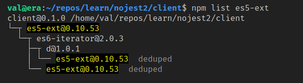
Рисунок 4.19 Отчёт о текущей версии es5-ext

Статистика npmjs.org сообщает о 11 миллионах загрузок **es5-ext** в неделю. Примечательно, что антивирусное ПО на компьютере разработчика никак не реагирует на загрузку и исполнение вредоносного кода. К сожалению, времена безоговорочного доверия популярным NPM пакетам ушли в прошлое.

## ИСТОЧНИКИ

4.1 https://redmonk.com/rstephens/2021/08/05/top-20-june-2021/

4.2 https://www.typescriptlang.org/

4.3 Сравнение существующих систем управления базами данных (А.В. Филипенков, Е.Л. Кузьмин)

4.4 https://www.informationweek.com/software/open-source-postgresql-trails-oracle-in-benchmark-but-not-by-much

4.5 Enhancement of the ANSI SQL Implementation of PostgreSQL (Stefan Simkovics) https://postgrespro.ru/docs/postgresql

4.6 https://github.com/stravnik/toxic-repos